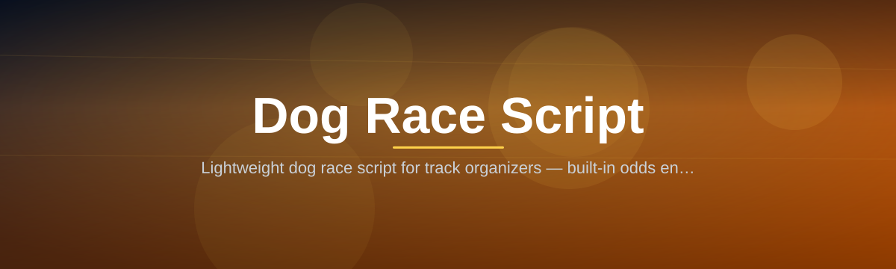

# Dog-Race-Script-580

Lightweight dog race script for track organizers — built-in odds engine, single binary, no dependencies.

  

## Overview

Lightweight dog race script for track organizers — built-in odds engine, single binary, no dependencies.

## License

[MIT License](LICENSE)
